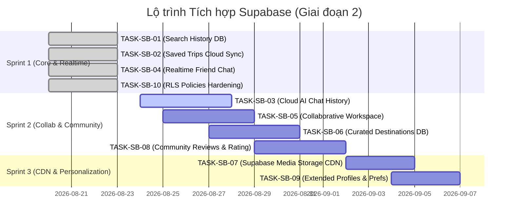

# BÁO CÁO REVIEW CODEBASE & KẾ HOẠCH TÍCH HỢP SUPABASE (GIAI ĐOẠN 2)

**Dự án:** `AIVIVU / voyz-master` (AI Travel Platform - Flutter/Dart)  
**Mục tiêu:** Chuyển đổi toàn diện từ dữ liệu cục bộ (Hive / SharedPreferences / Mock / Direct AI API) sang hệ sinh thái **Supabase Backend, Cloud Database & Realtime WebSocket** nhằm tối ưu hóa trải nghiệm người dùng (UX) và hiệu năng ứng dụng (Performance).

---

## 1. TỔNG QUAN HIỆN TRẠNG KIẾN TRÚC (ARCHITECTURAL AUDIT)

| Thành phần | Hiện trạng trong Codebase | Vấn đề / Hạn chế kỹ thuật |
| :--- | :--- | :--- |
| **Authentication & Profile** | Đã có Supabase Auth (`auth_screen.dart`), upload avatar lên Supabase Storage (`profile_service.dart`). | Dữ liệu người dùng còn phụ thuộc nhiều vào `userMetadata` của Auth, chưa có bảng `profiles` chuẩn để lưu sở thích du lịch, phong cách du lịch. |
| **Saved Trips & Workspaces** | Đang lưu hoàn toàn trong **Hive local box** (`saved_trips_provider.dart`). | Dữ liệu gắn liền với thiết bị. Đổi máy hoặc dùng bản Web là mất dữ liệu. Tính năng "Chia sẻ chuyến đi / Checklist / Ghi chú" chỉ là chuỗi lưu offline, không thể cộng tác thật. |
| **Search History** | Đã có Migration SQL nhưng code Dart (`search_history_service.dart`) từng **chỉ ghi vào Hive local box**. | Chưa gửi dữ liệu lên Supabase DB, bỏ lỡ khả năng phân tích hành vi và đồng bộ lịch sử tìm kiếm giữa các thiết bị. |
| **AI Chat History** | Lưu cục bộ bằng **Hive** (`chat_history_service.dart`). | Người dùng không xem lại được các đoạn hội thoại tư vấn khi đăng nhập trên thiết bị khác; không hỗ trợ quản lý nhiều phiên chat theo điểm đến. |
| **Explore & Trending** | Gọi trực tiếp Gemini API & scrape Wikimedia mỗi lần mở (`explore_screen.dart`, `image_service.dart`). | Thời gian phản hồi chậm (1–3s), tốn token AI và dễ bị giới hạn băng thông (rate-limit) từ Wikipedia. |
| **Social & Friends** | Đã có migration SQL và CRUD cơ bản (`friends_service.dart`). | Chưa kích hoạt **Supabase Realtime**; vẫn phải pull-to-refresh / polling định kỳ để nhận tin nhắn mới và cập nhật trạng thái bạn bè. |
| **Reviews & Ratings** | Đang sử dụng mock data (`mock_data.dart`) hoặc AI tự sinh. | Chưa có bảng đánh giá cộng đồng thực tế để người dùng chia sẻ trải nghiệm, ảnh chụp và xếp hạng điểm đến. |

---

## 2. PHÂN TÍCH CHI TIẾT TỪNG TÍNH NĂNG / MÀN HÌNH CẦN TÍCH HỢP

### 2.1. Module Saved Trips, Workspaces & Itinerary (Quản lý & Cộng tác chuyến đi)
* **Vị trí liên quan:** `lib/data/saved_trips_provider.dart`, `lib/screens/saved_screen.dart`, `lib/screens/destination_plan_screen.dart`.
* **Nhu cầu tích hợp Supabase:**
  - Thiết kế các bảng: `saved_trips` (thông tin chung, ngân sách, ngày đi, checklist, ghi chú, mã vé), `saved_itineraries` (lộ trình chi tiết từng ngày), `trip_collaborators` (phân quyền xem/chỉnh sửa).
  - Triển khai cơ chế Offline-First: Đọc/ghi Hive cục bộ để app phản hồi tức thì (0ms latency), sau đó đồng bộ ngầm 2 chiều (Sync engine) với Supabase Database qua RLS (`user_id = auth.uid()`).
* **Cải thiện UX & Performance:**
  - **UX:** Chống mất dữ liệu khi đổi máy; hỗ trợ nhiều người cùng lên kế hoạch chung cho một chuyến đi (Realtime Collaborative Workspace); đánh dấu checklist theo thời gian thực.
  - **Performance:** Giảm bớt số lần gọi AI tạo lại lịch trình nếu chuyến đi đã được lưu trên Cloud.

---

### 2.2. Module Search History & Smart Planner (Đồng bộ & Cá nhân hóa tìm kiếm)
* **Vị trí liên quan:** `lib/services/search_history_service.dart`, `lib/screens/smart_planner_screen.dart`.
* **Nhu cầu tích hợp Supabase:**
  - Kết nối service với bảng `search_history` trên Supabase kèm index theo thời gian (`search_history_user_created_at_idx`).
  - Bổ sung API lấy danh sách tìm kiếm gần đây (Recent Searches) có phân trang và xóa lịch sử.
* **Cải thiện UX & Performance:**
  - **UX:** Người dùng có thể 1-chạm để điền lại (auto-fill) toàn bộ form Smart Planner từ các tìm kiếm trước đó.
  - **Performance:** Phục vụ dữ liệu tìm kiếm cũ tức thì từ Database có Index, giảm công sức nhập liệu.

---

### 2.3. Module AI Chat History & Context Threading (Lịch sử hội thoại AI)
* **Vị trí liên quan:** `lib/services/chat_history_service.dart`, `lib/screens/chat_screen.dart`.
* **Nhu cầu tích hợp Supabase:**
  - Tạo bảng `chat_threads` (phiên chat theo điểm đến hoặc chủ đề) và `chat_messages` (chi tiết tin nhắn User / AI).
  - Tích hợp tính năng lưu ngữ cảnh hội thoại lên Supabase để duy trì mạch tư vấn du lịch.
* **Cải thiện UX & Performance:**
  - **UX:** Người dùng chuyển đổi liền mạch giữa ứng dụng Web và Mobile mà không bị đứt đoạn cuộc trò chuyện tư vấn với AI. Có thể tạo nhiều đoạn chat riêng biệt cho từng điểm đến.
  - **Performance:** Truy vấn tin nhắn phân trang (Pagination), không cần tải toàn bộ mảng tin nhắn lớn vào RAM cùng một lúc.

---

### 2.4. Module Explore, Trending Destinations & Image CDN (Kho dữ liệu điểm đến & Media)
* **Vị trí liên quan:** `lib/screens/explore_screen.dart`, `lib/services/image_service.dart`, `lib/screens/destination_detail_screen.dart`.
* **Nhu cầu tích hợp Supabase:**
  - Tạo bảng `destinations` (thông tin địa danh, quốc gia, mô tả chuẩn, tọa độ, thẻ tag) và `featured_destinations` (danh sách điểm đến nổi bật theo mùa/tháng do Admin hoặc thuật toán tuyển chọn).
  - Lưu trữ URL ảnh chất lượng cao trên Supabase Storage CDN thay vì scrape Wikimedia runtime.
* **Cải thiện UX & Performance:**
  - **UX:** Màn hình Explore hiển thị ngay lập tức (dưới 100ms) kèm hình ảnh sắc nét, ổn định; không còn tình trạng ảnh bị lỗi hoặc placeholder do Wikimedia chậm.
  - **Performance:** Giảm 80% số lượt gọi API Gemini và Wikimedia không cần thiết.

---

### 2.5. Module Social, Friends & Realtime Messaging (Mạng xã hội du lịch thời gian thực)
* **Vị trí liên quan:** `lib/services/friends_service.dart`, `lib/screens/friends_screen.dart`.
* **Nhu cầu tích hợp Supabase:**
  - Kích hoạt **Supabase Realtime Channel** (`supabase.channel('public:friend_messages')`) lắng nghe sự kiện `INSERT` trên bảng `friend_messages` và `friendships`.
  - Tích hợp tính năng Presence (xác định trạng thái bạn bè đang Online/Offline).
  - Cho phép gửi "Chia sẻ chuyến đi" (Share Trip Card) trực tiếp vào khung chat bạn bè.
* **Cải thiện UX & Performance:**
  - **UX:** Nhận tin nhắn chat và thông báo kết bạn tức thì không cần vuốt để tải lại màn hình.
  - **Performance:** Thay thế cơ chế Polling định kỳ bằng kết nối WebSocket tiết kiệm pin và băng thông mạng.

---

### 2.6. Module Community Reviews, Ratings & Bookmarks (Đánh giá cộng đồng)
* **Vị trí liên quan:** `lib/screens/destination_detail_screen.dart`, `lib/data/mock_data.dart`.
* **Nhu cầu tích hợp Supabase:**
  - Tạo bảng `destination_reviews` (số sao 1–5, nhận xét text, ảnh thực tế tải lên bucket `review-media`, `user_id`, `destination_id`).
  - Tạo PostgreSQL Function/Trigger tự động tính điểm `average_rating` và `review_count` cho điểm đến.
* **Cải thiện UX & Performance:**
  - **UX:** Cung cấp đánh giá khách quan, thực tế từ cộng đồng du lịch thay vì các con số giả lập; người dùng có thể đóng góp trải nghiệm của bản thân.
  - **Performance:** Điểm đánh giá trung bình được tính toán tự động ở phía database (Pre-aggregated), giảm tải xử lý tính toán cho ứng dụng client.

---

### 2.7. Module User Profile & Travel Preferences (Mở rộng hồ sơ cá nhân)
* **Vị trí liên quan:** `lib/screens/profile_screen.dart`, `lib/services/profile_service.dart`.
* **Nhu cầu tích hợp Supabase:**
  - Tạo bảng chuẩn `public.profiles` đồng bộ với `auth.users` qua Database Trigger.
  - Lưu trữ các trường nâng cao: `preferred_currency`, `home_city`, `travel_styles` (ví dụ: thích biển, khám phá, ẩm thực), `bio`.
* **Cải thiện UX & Performance:**
  - **UX:** Trải nghiệm cá nhân hóa cao: Tự động chọn đơn vị tiền tệ mặc định và sở thích cá nhân khi mở Smart Planner mà không cần chọn lại mỗi lần.
  - **Performance:** Dễ dàng join dữ liệu với các bảng bạn bè, review mà không cần gọi Auth Admin API.

---

## 3. BẢNG TỔNG HỢP NHIỆM VỤ & TIẾN ĐỘ (TASK TRACKING MATRIX)

| Task ID | Tên tính năng | Mô tả ngắn gọn (Short Description) | Assignee | Priority | Sprint | Status |
| :--- | :--- | :--- | :--- | :---: | :---: | :---: |
| **TASK-SB-01** | Connect Search History to Supabase DB | Chuyển `SearchHistoryService` từ chỉ ghi Hive sang đồng bộ hai chiều với bảng `search_history` trên Supabase. | Fullstack | **P0** | Sprint 1 | **Done** ✅ |
| **TASK-SB-02** | Cloud Sync for Saved Trips & Itineraries | Xây dựng Schema `saved_trips`, `saved_itineraries` và cơ chế Offline-First Sync hai chiều trong `SavedTripsProvider`. | Fullstack | **P0** | Sprint 1 | **Done** ✅ |
| **TASK-SB-04** | Supabase Realtime for Friend Chat & Social | Tích hợp Supabase Realtime WebSocket vào `friends_service.dart` và `FriendChatScreen` để nhận tin nhắn tức thì (bỏ polling 4s). | Frontend | **P0** | Sprint 1 | **Done** ✅ |
| **TASK-SB-10** | Supabase Security & RLS Policy Hardening | Thiết lập Row Level Security (RLS) chặt chẽ (`auth.uid() = user_id`) cho toàn bộ bảng và cấp quyền realtime replication. | Backend | **P0** | Sprint 1 | **Done** ✅ |
| **TASK-SB-03** | Cloud AI Chat Threads & Messages | Thiết kế bảng `chat_threads`/`chat_messages` và nâng cấp `ChatHistoryService` để lưu & tải lịch sử chat đa thiết bị theo user. | Backend / Fullstack | **P1** | Sprint 2 | **To Do** 📋 |
| **TASK-SB-05** | Realtime Collaborative Trip Workspace | Mở rộng bảng `trip_collaborators` và đồng bộ realtime ghi chú/checklist giữa các thành viên cùng tham gia chuyến đi. | Fullstack | **P1** | Sprint 2 | **To Do** 📋 |
| **TASK-SB-06** | Destinations & Trending Curated DB | Tạo bảng `destinations`, `featured_destinations` trên Supabase và chuyển `ExploreScreen` sang đọc dữ liệu DB kèm cache. | Backend / Fullstack | **P1** | Sprint 2 | **To Do** 📋 |
| **TASK-SB-08** | Community Reviews & Rating System | Xây dựng bảng `destination_reviews`, trigger tính rating trung bình và UI đánh giá trong `DestinationDetailScreen`. | Fullstack | **P1** | Sprint 2 | **To Do** 📋 |
| **TASK-SB-07** | Destination Media Storage CDN | Lưu trữ kho ảnh điểm đến chất lượng cao trên Supabase Storage CDN, thay thế cho việc gọi Wikimedia runtime. | Backend | **P2** | Sprint 3 | **To Do** 📋 |
| **TASK-SB-09** | Extended Profiles & Travel Preferences | Mở rộng bảng `public.profiles`, lưu sở thích du lịch & tiền tệ mặc định, liên kết tự động vào form Smart Planner. | Fullstack | **P2** | Sprint 3 | **To Do** 📋 |

---

## 4. LỘ TRÌNH TRIỂN KHAI THEO SPRINT (SPRINT ROADMAP)

