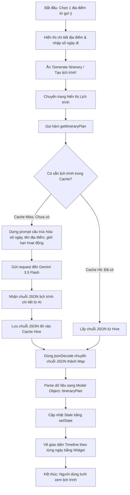

# Hướng dẫn chi tiết: Logic của tính năng "Lên kế hoạch du lịch theo từng ngày/địa điểm" (Itinerary Planning)

Chào mừng bạn tiếp tục cuộc hành trình khám phá lập trình! Hôm nay chúng ta sẽ cùng phân tích tính năng thứ hai của dự án **Voyz**: **Lên kế hoạch du lịch chi tiết theo từng ngày và địa điểm cụ thể** (Itinerary Planning). 

Nếu ở tính năng trước, AI đóng vai trò gợi ý các thành phố/đất nước (ví dụ: Đà Nẵng, Phú Quốc, Bali), thì ở tính năng này, AI sẽ làm việc như một **chuyên viên điều hành tour** thực thụ. AI sẽ sắp xếp lịch trình chi tiết: sáng đi đâu, trưa ăn gì, chiều tối trải nghiệm gì và có mẹo hữu ích nào cho từng ngày.

---

## 1. TỔNG QUAN HỆ THỐNG (SYSTEM OVERVIEW)

Tính năng này kết nối trực tiếp từ lựa chọn của người dùng tại màn hình chi tiết địa điểm.

### Mô hình ASCII mô tả luồng hoạt động:

```text
+-------------------+      (1) Chọn điểm đến & số ngày     +-----------------------+
|  Chi tiết địa điểm| -----------------------------------> |    Itinerary Screen   |
| (DestinationDetail|                                      |   (Màn hình hiển thị  |
|     Screen)       | <----------------------------------- |     lịch trình)       |
+-------------------+       (6) Vẽ Timeline từng ngày      +-----------------------+
          ^                                                            |
          |                                                            | (2) Truy vấn
          | (5) Parse Object                                           | Cache
          |     ItineraryPlan                                          v
+-------------------+      (4) Trả về JSON String          +-----------------------+
|  Gemini Service   | <----------------------------------- |     Cache Service     |
| (Giao tiếp API)   |                                      | (Hive / Bộ nhớ tạm)   |
+-------------------+                                      +-----------------------+
          |                                                            |
          | (3) Gửi Prompt yêu cầu lịch trình                          | (Nếu chưa lưu
          |     (Nếu Cache Miss)                                       |  lịch trình này)
          v                                                            v
+----------------------------------------------------------------------------------+
|                              GEMINI 3.5 FLASH API                                |
|             (Tạo lịch trình: thời gian, hoạt động, mô tả, mẹo du lịch)           |
+----------------------------------------------------------------------------------+
```

---

## 2. LUỒNG XỬ LÝ DỮ LIỆU CHI TIẾT (FLOWCHART)

Dưới đây là sơ đồ chi tiết biểu diễn luồng hoạt động từ lúc người dùng bắt đầu chọn điểm đến và xem lịch trình:



---

## 3. CHI TIẾT TỪNG BƯỚC & CÔNG NGHỆ CHỦ CHỐT

### Bước 1: Tiếp nhận yêu cầu từ UI
*   **File tham chiếu:** `lib/screens/destination_detail_screen.dart` hoặc các màn hình lựa chọn kế hoạch.
*   **Cách hoạt động:** Khi người dùng quyết định lên kế hoạch cho một địa điểm cụ thể (ví dụ: "Phú Quốc" trong 3 ngày), ứng dụng sẽ thu thập thông tin này và truyền sang trang hiển thị lịch trình.

---

### Bước 2: Thiết kế Prompt chuyên sâu cho Lịch trình
*   **File tham chiếu:** [GeminiService._buildItineraryPrompt()](file:///d:/AIVIVU/voyz-master/lib/services/gemini_service.dart#L366)
*   **Cách hoạt động:** Hàm này xây dựng cấu trúc prompt gửi cho AI với các yêu cầu cụ thể:
    *   Tên địa điểm cần lên kế hoạch.
    *   Số lượng ngày du lịch (`numDays`).
    *   Giới hạn số hoạt động mỗi ngày (`limit`).
    *   **Cấu trúc JSON mong muốn** gồm: `destinationName`, `dateRange`, `days` (mảng các ngày chứa `dayNumber`, `title`, `subtitle`, và danh sách các `items` hoạt động có `time`, `title`, `description`, `icon`), và `proTip`.
*   **Công nghệ chủ chốt:** **Prompt Engineering**. Việc quy định rõ danh sách icon được dùng (`flight_land`, `hotel`, `restaurant`, `beach_access`) giúp ứng dụng Flutter tự động hiển thị các biểu tượng đẹp mắt tương ứng mà không bị lỗi hiển thị.

---

### Bước 3: Cache lịch trình cục bộ bằng Hive
*   **File tham chiếu:** [GeminiService.getItineraryPlan()](file:///d:/AIVIVU/voyz-master/lib/services/gemini_service.dart#L329)
*   **Cách hoạt động:** Để tối ưu chi phí và tăng tốc độ phản hồi:
    *   Tạo cache key bằng cách kết hợp tên địa điểm và số ngày du lịch (ví dụ: `itinerary_PhuQuoc_3days`).
    *   Nếu có cache, lấy thẳng chuỗi JSON cũ ra dùng. Nếu chưa, gọi API của Gemini, sau đó lưu kết quả trả về vào database **Hive** để những lần xem sau diễn ra ngay tức khắc.
*   **Công nghệ chủ chốt:** **Hive Database (Key-Value Cache)**.

---

### Bước 4: Chuyển đổi dữ liệu JSON sang Model Object (Deserialization)
*   **File tham chiếu:** [ItineraryPlan.fromJson()](file:///d:/AIVIVU/voyz-master/lib/models/itinerary_plan.dart)
*   **Cách hoạt động:** 
    *   Ứng dụng sử dụng lớp mô hình `ItineraryPlan`, `ItineraryDay` và `ItineraryItem` để cấu trúc hóa dữ liệu.
    *   Hàm `jsonDecode(text)` chuyển chuỗi văn bản thuần túy nhận được từ AI thành kiểu dữ liệu `Map<String, dynamic>`.
    *   Sau đó gọi `ItineraryPlan.fromJson(json)` để chuyển đổi map đó thành đối tượng Dart có thuộc tính rõ ràng. Điều này giúp ngăn ngừa lỗi gõ sai tên trường dữ liệu trong quá trình thiết kế UI.
*   **Công nghệ chủ chốt:** **Dart Serialization / JSON Parsing**.

---

### Bước 5: Render Timeline UI sinh động
*   **Cách hoạt động:** 
    *   Lịch trình sau khi được phân tích thành đối tượng `ItineraryPlan` sẽ được render qua các ListView chứa widget custom dạng timeline.
    *   Mỗi ngày (`ItineraryDay`) được hiển thị bằng một thẻ lớn chứa danh sách các hoạt động (`ItineraryItem`).
    *   Mỗi hoạt động có thời gian, tiêu đề, mô tả và icon thích hợp, tạo nên trải nghiệm người dùng hiện đại và cuốn hút.

---

## 4. HIGHLIGHTS CHO LẬP TRÌNH VIÊN MỚI

1.  **Tính Nhất Quán Của Dữ Liệu (Data Integrity)**: Khi AI trả về danh sách hoạt động, các biểu tượng (`icon`) cần phải nằm trong danh mục các icon mà ứng dụng của bạn hỗ trợ (Ví dụ: `flight_land`, `hotel`, `restaurant`). Định nghĩa rõ danh mục này trong Prompt là cách tốt nhất để đồng bộ giữa AI và UI code.
2.  **Xử lý Bất đồng bộ (Async/Await)**: Do thời gian sinh lịch trình mất vài giây, việc sử dụng các widget hiển thị trạng thái chờ (Shimmer effect hoặc Loading spinner) là bắt buộc để người dùng không cảm thấy ứng dụng bị treo.
3.  **Tách Biệt Model & Logic**: Việc viết riêng các Model (`ItineraryPlan`) và Service (`GeminiService`) giúp mã nguồn sạch sẽ, dễ bảo trì và dễ viết Unit Test kiểm thử.
