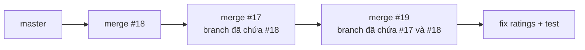

# Bài học: Gộp 3 PR song song (#17, #18, #19) và sửa số liệu đánh giá

> Ngày: 04/10/2026. Người thực hiện: giáo viên hướng dẫn (harvy2702) cùng Claude.
> Đọc kèm: các commit merge trên nhánh `image-loading-effects` và `destination-ratings-and-draggable-ai-button`.

## 1. Tình huống

Ba PR được mở gần như cùng lúc, mỗi PR đều merge sạch vào `master` khi đứng một mình:

| PR | Nội dung chính | File chung với PR khác |
|---|---|---|
| #18 | Avatar có sẵn, sửa tên, padding ô nhập, nhạc nền vào Profile | `main.dart`, `profile_screen.dart` |
| #17 | Nút AI Tools tròn, loading tên lửa, nhạc nền vào Profile, mặc định tiếng Việt | `main.dart`, `profile_screen.dart`, `ai_tools_button.dart` |
| #19 | Nút AI Tools kéo thả, số liệu đánh giá địa điểm | `main.dart`, `ai_tools_button.dart`, `destination_detail_screen.dart` |

Khi merge PR đầu tiên, hai PR còn lại có conflict ngay. Nguyên nhân gốc không phải là Git. Nguyên nhân gốc là **hai PR làm cùng một việc mà không ai biết**:

- #17 và #18 cùng chuyển nút nhạc nền vào Profile, mỗi bên viết một thẻ riêng.
- #17 và #19 cùng viết lại `ai_tools_button.dart` theo hai hướng.

Bài học 1: trước khi bắt đầu một tính năng, hãy ghi tên mình vào roadmap hoặc issue. Người khác sẽ thấy và không làm trùng.

## 2. Thứ tự gộp và cách giải conflict



Nguyên tắc: gộp PR ít conflict nhất trước (#18), sau đó đưa nhánh trước vào nhánh sau, giải conflict ngay trên nhánh của PR. Như vậy mỗi PR trên GitHub đều merge sạch theo thứ tự.

Các quyết định khi giải conflict:

1. **`profile_screen.dart`:** giữ một thẻ "Nhạc nền" là bản của #18. Bản này có dấu tiếng Việt. Bản của #17 viết "Nhac nen", không dấu. Hai thẻ cùng làm một việc thì chỉ giữ một.
2. **`ai_tools_button.dart`:** lấy bản của #19. Bản này đã dựa trên thiết kế nút tròn của #17 và thêm kéo thả, nên nó chứa trọn ý của #17.
3. **`main.dart`:** giữ `AivivuPageBackground` (nền vũ trụ). Xem mục 3.

## 3. Regression bị giấu trong commit "cleanup imports"

Commit `1947294 fix(ui): adjust AI tools button layout and cleanup imports` của #17 đã xóa `AivivuPageBackground` khỏi `MaterialApp.builder`. Spec của #17 không có yêu cầu này. Kết quả: toàn bộ app mất nền vũ trụ, mà test vẫn xanh.

Cách phát hiện:

```bash
git log origin/master -S'AivivuPageBackground(' -- lib/main.dart   # ai thêm dòng này
git log pr17 -S'AivivuPageBackground(' -- lib/main.dart            # ai xóa dòng này
```

Bài học 2: commit message phải nói đúng việc commit làm. "Cleanup imports" mà xóa một widget là commit nói sai. Khi rebase hoặc giải conflict, hãy đọc lại diff của từng file trước khi commit.

## 4. Số liệu đánh giá: vì sao bỏ "100 vote ảo"

#19 cộng sẵn 100 lượt đánh giá 5 sao cho mọi địa điểm, và cố ý giấu cơ chế này khỏi người dùng. Có ba vấn đề:

1. **Người dùng bị đánh lừa.** Chữ "100 lượt" nghĩa là 100 người đã đánh giá. Thực tế chưa có ai. Đây là số liệu giả.
2. **Đánh giá thật gần như vô nghĩa.** Với 100 vote 5 sao làm gốc, cần khoảng 100 vote 1 sao thì điểm mới xuống 3 sao. Năm người chê vẫn hiện 4.8 sao.
3. **Migration ghi đè dữ liệu thật.** Lệnh `update public.destinations` đặt lại `rating` và `review_count` cho mọi địa điểm.

Cách sửa (commit `fix(ratings)`):

- `DestinationRatingCalculator` chỉ dùng đánh giá thật. Chưa có đánh giá thì trả về `null`, và UI hiện "Chưa có đánh giá".
- Bỏ migration `20261002000100`. Migration này chưa từng chạy lên cloud. Trigger `community_reviews_refresh_stats_trigger` (migration `20260829000100`) đã tự cập nhật `rating` và `review_count` mỗi khi có đánh giá.
- Bỏ đoạn client gọi lại RPC rồi tự `update` bảng `destinations`. Trigger đã làm việc này. RLS cũng chặn client sửa bảng đó, và lỗi bị nuốt bởi `catch (_) {}`, nên đoạn code đó chưa bao giờ chạy đúng.

Phần tốt của #19 vẫn được giữ: Explore và trang chi tiết dùng chung một cách tính, Explore tải lại số liệu khi quay về, và nhãn "lượt" dễ đọc.

Nếu sau này cần **xếp hạng** địa điểm ít đánh giá cho công bằng, hãy dùng trung bình có trọng số (Bayesian average) **chỉ để sắp xếp**. Con số hiển thị cho người dùng vẫn phải là số thật.

Bài học 3: con số hiển thị cho người dùng phải có căn cứ. Nếu bạn phải giấu cách tính một con số, đó là dấu hiệu con số đó không trung thực.

## 5. Kiểm chứng bằng máy

| Bước | Kết quả |
|---|---|
| `flutter analyze` trên master | 19 issue, 3 warning |
| `flutter analyze` sau khi gộp | 12 issue, 0 error, 0 warning |
| `flutter test` trên master | 114 pass |
| `flutter test` sau khi gộp | 134 pass |
| `flutter build web --release` | build thành công, màn hình đăng nhập mở được |
| Truy vấn `destinations(*, community_reviews(rating))` trên cloud | chạy đúng |

Test mới `AIToolsButton sits bottom-right inside the app shell` dựng lại đúng cấu trúc `MaterialApp.builder` trong `main.dart`. Test kiểm tra vị trí mặc định của nút và kiểm tra kéo thả.

## 6. Checklist cho lần mở PR sau

1. Ghi tên mình vào roadmap trước khi làm một tính năng.
2. Rebase lên `master` mới nhất ngay trước khi mở PR.
3. Đọc lại toàn bộ diff của PR. Xóa mọi thay đổi không có trong spec.
4. Chạy `flutter analyze` và `flutter test`, rồi dán kết quả vào mô tả PR.
5. Mỗi migration phải ghi rõ nó có ghi đè dữ liệu hiện có hay không.
6. Không hiển thị số liệu giả cho người dùng.

<sub>STE80</sub>
