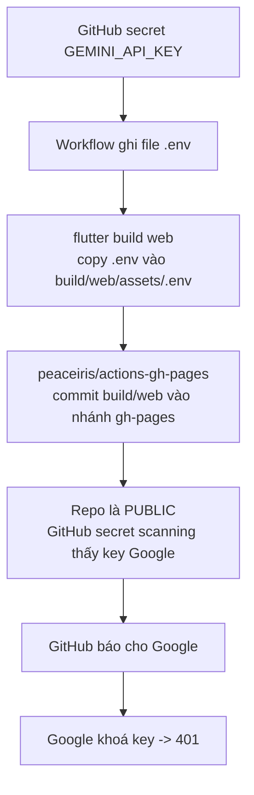

# Bài học: Key Gemini chết ngay sau khi deploy lên GitHub Pages

> Ngày: 10/10/2026. Người thực hiện: giáo viên hướng dẫn (harvy2702) cùng Claude.
> File liên quan: `.github/workflows/deploy-web.yml`.

## 1. Tình huống

App chạy tốt trên máy học sinh. Trên trang live `https://leemingduc.github.io/voyz-master/`, mọi lời gọi Gemini trả về lỗi:

```
401 UNAUTHENTICATED, reason ACCESS_TOKEN_TYPE_UNSUPPORTED
```

Chúng ta đổi key trong GitHub secret ba lần. Lần nào key cũng chết khoảng một phút sau khi deploy:

| Key (4 ký tự cuối) | Đã lên trang live? | Còn dùng được? |
|---|---|---|
| `m0Ug` | Chưa bao giờ | Có |
| `F9Fg` | Có | Không |
| `4koQ` | Có | Không |
| `oN3A` | Có | Không |

Key nào lên trang live thì chết. Key nào chưa lên thì còn sống. Vậy lỗi không nằm ở key, mà nằm ở cách deploy.

## 2. Nguyên nhân



Workflow cũ commit toàn bộ thư mục build vào nhánh `gh-pages`. Thư mục build có file `assets/.env` chứa key. Repo là public, nên GitHub quét commit mới, thấy key Google và báo cho Google. Google khoá key để bảo vệ chủ key.

Trên máy học sinh, `.env` nằm trong `.gitignore`, nên key không bao giờ vào commit. Vì vậy key chạy được ở local.

Bài học 1: khi "local chạy, live không chạy", hãy so sánh từng bước giữa hai môi trường. Ở đây khác biệt là: live có một commit chứa key, local thì không.

## 3. Cách sửa (ngắn hạn)

Workflow mới không commit gì cả. Nó upload thư mục build thành một *Pages artifact*, rồi deploy artifact đó:

| | Workflow cũ | Workflow mới |
|---|---|---|
| Deploy bằng | `peaceiris/actions-gh-pages` | `actions/upload-pages-artifact` + `actions/deploy-pages` |
| Build nằm ở đâu | Commit trong nhánh `gh-pages` (public) | Artifact, không vào git |
| Secret scanning thấy key? | Có | Không |

Hai chi tiết dễ sai:

1. `upload-pages-artifact` từ v4 bỏ qua file bắt đầu bằng dấu chấm. `assets/.env` là file như vậy. Nếu quên `include-hidden-files: true`, app lên live sẽ không có key nào, kể cả Supabase.
2. Workflow có bước `test -s build/web/assets/.env`. Bước này dừng build ngay nếu file `.env` bị thiếu, thay vì để lỗi xuất hiện trên trang live.

Chủ repo (`leemingduc`) phải làm một lần trong Settings, vì việc này cần quyền admin:

1. Mở **Settings > Pages**, chọn **Source = GitHub Actions**.
2. Mở **Settings > Environments > github-pages**. Kiểm tra rằng nhánh `master` được phép deploy. Hiện tại environment chỉ cho phép nhánh `gh-pages`.
3. Tạo key Gemini mới, cập nhật secret `GEMINI_API_KEY`, rồi chạy lại workflow.
4. Sau khi trang live chạy ổn, xoá nhánh `gh-pages`. Nhánh này còn chứa các key cũ (đã chết).

## 4. Giới hạn của cách sửa này

Key vẫn công khai. Ai mở `https://leemingduc.github.io/voyz-master/assets/.env` cũng đọc được key. Cách sửa này chỉ ngăn GitHub báo key cho Google, nó không giấu key.

Với project học tập, chúng ta chấp nhận điều này. Để giảm rủi ro bị dùng trộm quota, hãy giới hạn key trong Google Cloud Console:

- Chỉ cho phép API "Generative Language API".
- Chỉ cho phép HTTP referrer `https://leemingduc.github.io/*` (thêm `http://localhost:*` nếu dùng chung key để chạy local).
- Đặt quota thấp.

Bài học 2: mọi thứ trong app web đều là công khai. File `.env` trong Flutter Web không phải là nơi giữ bí mật. Nó chỉ là nơi để cấu hình. Muốn giữ key thật sự bí mật, phải gọi Gemini từ server (ví dụ Supabase Edge Function). Project này chưa làm việc đó.

<sub>STE80</sub>
