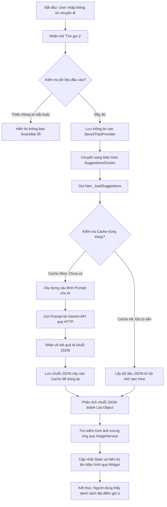

# Hướng dẫn chi tiết: Logic của tính năng "Gợi ý địa điểm du lịch bằng AI" (AI Travel Suggestions)

Xin chào bạn! Rất vui được đồng hành cùng bạn trên con đường học lập trình. Hôm nay, chúng ta sẽ cùng nhau "mổ xẻ" một tính năng cực kỳ thú vị và thực tế trong dự án **Voyz**: **Gợi ý địa điểm du lịch dựa trên thông tin người dùng cung cấp**.

Là một lập trình viên mới bắt đầu, có thể bạn sẽ thấy tính năng AI này có vẻ "ma thuật". Nhưng thực tế, nó được xây dựng trên một quy trình logic rất chặt chẽ, kết hợp giữa lập trình ứng dụng (Mobile App), Thiết kế câu lệnh (Prompt Engineering) và Trí tuệ nhân tạo (Generative AI).

Chúng ta sẽ đi từ **Tổng quan** đến **Chi tiết** nhé!

---

## 1. TỔNG QUAN HỆ THỐNG (SYSTEM OVERVIEW)

Hãy tưởng tượng tính năng này như một người phục vụ trong quán ăn:
1. Bạn (Người dùng) gọi món và đưa ra các yêu cầu đặc biệt (địa điểm, ngân sách, sở thích).
2. Người phục vụ (Ứng dụng Flutter) ghi chép lại, dịch nó sang một ngôn ngữ chuẩn hóa (Prompt).
3. Đầu bếp (Gemini AI) dựa trên yêu cầu đó để chế biến ra món ăn (Dữ liệu JSON).
4. Người phục vụ trang trí món ăn đẹp mắt kèm hình ảnh (Image API) rồi mang ra cho bạn thưởng thức trên màn hình.

### Sơ đồ ASCII mô tả luồng hoạt động:

```text
+-------------------+      (1) Gửi Form thông tin      +-----------------------+
|    Giao diện      | -------------------------------> |    SmartPlanner       |
|    Flutter UI     |                                  |   (Lấy & lưu Data)    |
| (Người dùng nhập) | <------------------------------- |                       |
+-------------------+      (6) Vẽ danh sách gợi ý      +-----------------------+
          ^                                                        |
          |                                                        | (2) Kiểm tra
          | (5) Map ảnh &                                          | Cache
          | Parse Object                                           v
+-------------------+      (4) Trả về JSON String      +-----------------------+
|  Gemini Service   | <------------------------------- |     Cache Service     |
| (Xử lý ảnh & Data)|                                  | (Hive / Bộ nhớ tạm)   |
+-------------------+                                  +-----------------------+
          |                                                        |
          | (3) Gửi Prompt đã dựng                                 | (Nếu chưa có
          |     (Nếu Cache Miss)                                   |  trong Cache)
          v                                                        v
+------------------------------------------------------------------------------+
|                            GEMINI 3.5 FLASH API                              |
|                       (Trí tuệ nhân tạo xử lý logic)                         |
+------------------------------------------------------------------------------+
```

---

## 2. LUỒNG XỬ LÝ DỮ LIỆU CHI TIẾT (FLOWCHART)

Dưới đây là sơ đồ chi tiết biểu diễn luồng hoạt động từ lúc người dùng nhấn nút "Gợi ý địa điểm" cho đến khi hiển thị kết quả lên màn hình:



---

## 3. GIẢI THÍCH CHI TIẾT TỪNG BƯỚC & CÔNG NGHỆ CHỦ CHỐT

Hãy cùng đi sâu vào mã nguồn thực tế của dự án để xem các công nghệ được áp dụng như thế nào:

### Bước 1: Thu thập thông tin từ Giao diện (Flutter UI)
*   **File tham chiếu:** `lib/screens/smart_planner_screen.dart`
*   **Cách hoạt động:** Sử dụng các `TextEditingController` để bắt văn bản từ các trường nhập liệu (Điểm đến, Ngân sách, Số người, Độ tuổi) kết hợp chọn ngày tháng bằng `DatePicker` và chọn sở thích thông qua các `InterestChip`.
*   **Điểm mấu chốt:** Validation (Kiểm tra hợp lệ dữ liệu). Ứng dụng phải kiểm tra xem người dùng đã nhập đủ các trường bắt buộc chưa trước khi gửi yêu cầu đi để tránh lãng phí tài nguyên hệ thống.

---

### Bước 2: Thiết kế câu lệnh cho AI (Prompt Engineering)
*   **File tham chiếu:** [GeminiService._buildSuggestionsPrompt()](file:///d:/AIVIVU/voyz-master/lib/services/gemini_service.dart#L178)
*   **Cách hoạt động:** Đây là phần **cực kỳ quan trọng**. Hàm này ghép nối các thông tin người dùng đã nhập thành một đoạn văn hoàn chỉnh bằng tiếng Việt để gửi cho AI. 
*   **Đặc biệt:** Prompt yêu cầu AI trả về dữ liệu dưới dạng **JSON Array cấu trúc cố định** thay vì văn bản tự do thông thường:
    ```json
    {
      "name": "Tên địa điểm, Quốc gia",
      "matchPercent": 85,
      "rating": 4.5,
      "reviewCount": 120,
      "price": "~4.2M VNĐ",
      "aiInsight": "Nhận xét ngắn gọn về sự phù hợp với người dùng",
      "isTopMatch": false
    }
    ```
*   **Công nghệ chủ chốt:** **Prompt Engineering**. Việc ép định dạng đầu ra (Output Formatting) là `application/json` giúp lập trình viên dễ dàng lập trình để bóc tách thông tin sau đó.

---

### Bước 3: Cơ chế Bộ nhớ đệm (Caching) để tiết kiệm chi phí
*   **File tham chiếu:** [GeminiService.getSuggestions()](file:///d:/AIVIVU/voyz-master/lib/services/gemini_service.dart#L110)
*   **Cách hoạt động:** Gọi API của AI (như Gemini) tốn tiền (tính theo số ký tự/tokens) và tốn thời gian chờ đợi. Để tối ưu:
    1. Hệ thống tạo ra một mã định danh duy nhất (Cache Key) dựa trên các thông số người dùng nhập (ví dụ: `suggestions_Hanoi_10M_budget`).
    2. Trước khi gọi API, hệ thống sẽ hỏi `CacheService` xem khoá này đã có dữ liệu chưa.
    3. Nếu có rồi (**Cache Hit**), trả về ngay lập tức. Nếu chưa (**Cache Miss**), mới gọi API của Gemini và lưu kết quả lại vào database nội bộ (Hive).
*   **Công nghệ chủ chốt:** **Hive Database / Cache Service** - Một cơ sở dữ liệu NoSQL cục bộ có tốc độ đọc ghi siêu nhanh cho Flutter.

---

### Bước 4: Gọi API Gemini & Phân tích dữ liệu (Parsing)
*   **File tham chiếu:** `lib/services/gemini_service.dart`
*   **Cách hoạt động:** 
    *   Sử dụng package chính thức `google_generative_ai` của Google để gửi yêu cầu đến mô hình **Gemini 3.5 Flash** (mô hình nhẹ, phản hồi nhanh và chi phí thấp).
    *   Khi nhận được chuỗi văn bản JSON từ AI, hệ thống dùng hàm `jsonDecode()` để chuyển từ dạng chuỗi (String) thành đối tượng Map/List của Dart, sau đó khởi tạo các Model Object `DestinationSuggestion`.
    *   Vì AI không tự động trả về link ảnh đẹp cho từng địa điểm, hệ thống chạy thêm `ImageService.instance.getImageUrls(names)` để tìm kiếm ảnh minh họa phù hợp cho từng địa danh.

---

### Bước 5: Hiển thị lên màn hình (Widget Rendering)
*   **File tham chiếu:** `lib/screens/suggestions_screen.dart`
*   **Cách hoạt động:** 
    *   Trong Flutter, màn hình này sử dụng `StatefulWidget`. Khi bắt đầu (`initState`), nó sẽ gọi hàm `_loadSuggestions()` bất đồng bộ (`async/await`).
    *   Trong khi đợi dữ liệu, biến `_isLoading` là `true` để hiển thị vòng xoay chờ đợi (Loading Indicator).
    *   Khi dữ liệu được tải xong, gọi hàm `setState()` để gán danh sách gợi ý vào biến `_suggestions` và đặt `_isLoading = false`. Flutter sẽ tự vẽ lại giao diện với danh sách thẻ địa điểm cực kỳ sinh động!

---

## 4. BÀI HỌC VÀ LƯU Ý CHO LẬP TRÌNH VIÊN MỚI

Khi phát triển các tính năng tích hợp AI, bạn cần luôn ghi nhớ 3 nguyên tắc vàng sau:

1.  **Dữ liệu AI không phải lúc nào cũng chính xác (Hallucination):** Luôn luôn có bước Validate hoặc xử lý lỗi (`try-catch`) khi phân tích cú pháp dữ liệu từ AI phòng trường hợp AI trả về chuỗi JSON bị lỗi cấu trúc.
2.  **Tối ưu hoá hiệu năng bằng Cache:** Không bao giờ gọi AI vô tội vạ. Hãy tận dụng bộ nhớ đệm (Cache) cục bộ để ứng dụng chạy mượt mà và giảm chi phí vận hành.
3.  **Trải nghiệm người dùng (UX):** Cuộc gọi AI thường mất từ 2-5 giây. Hãy luôn thiết kế hiệu ứng Loading đẹp mắt để người dùng không cảm thấy ứng dụng bị "đơ" hay bị lỗi.

Hy vọng qua bài giải thích này, bạn đã nắm vững được cách kết nối giữa Flutter và AI một cách trực quan nhất. Hãy thử mở các file code được liệt kê ở trên và đọc thử nhé! Chúc bạn học tốt!
